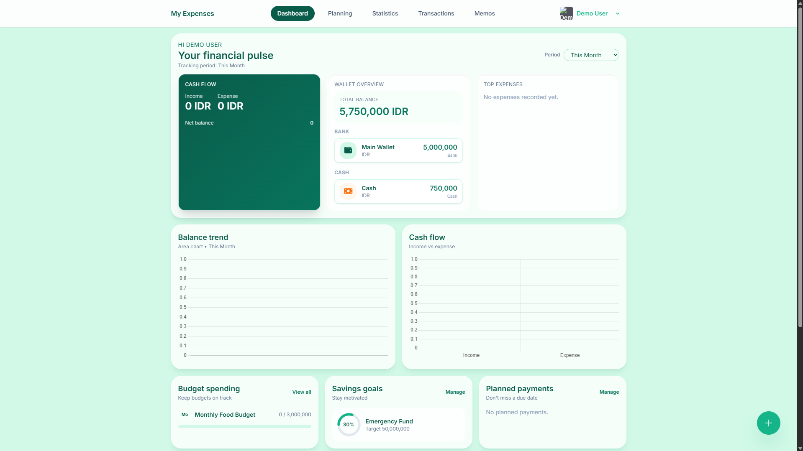
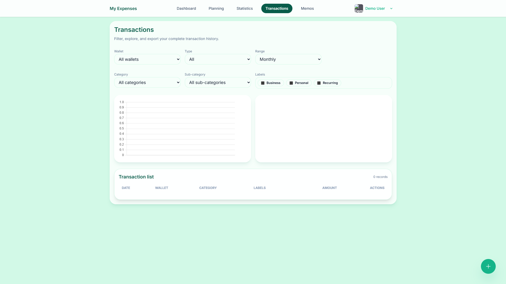
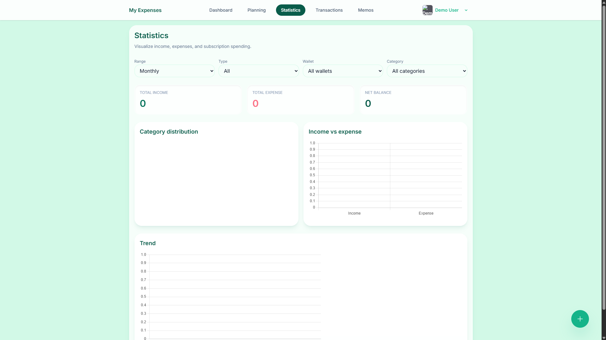
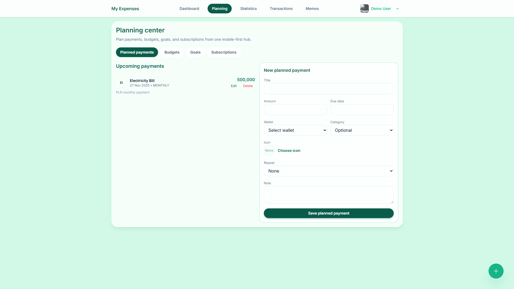
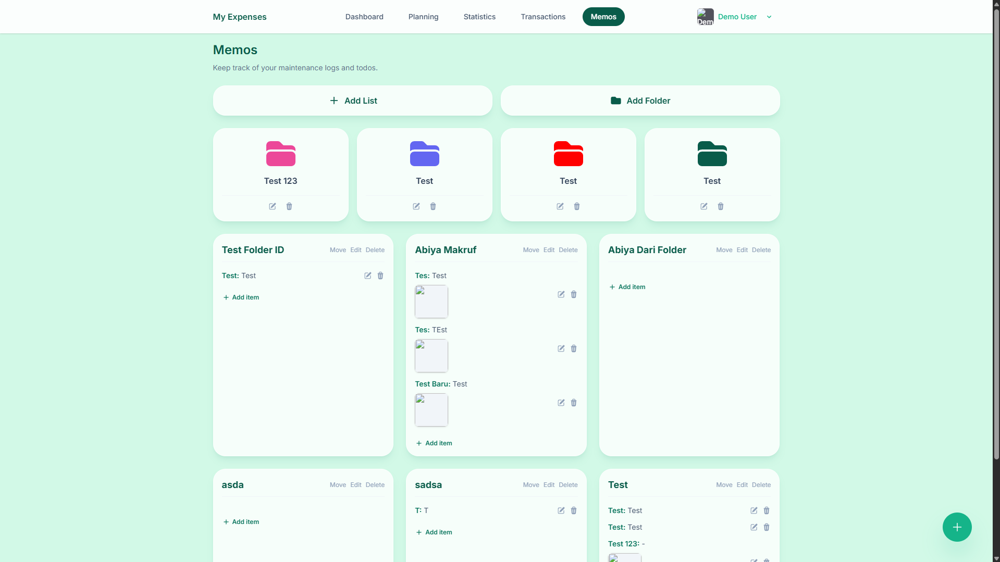
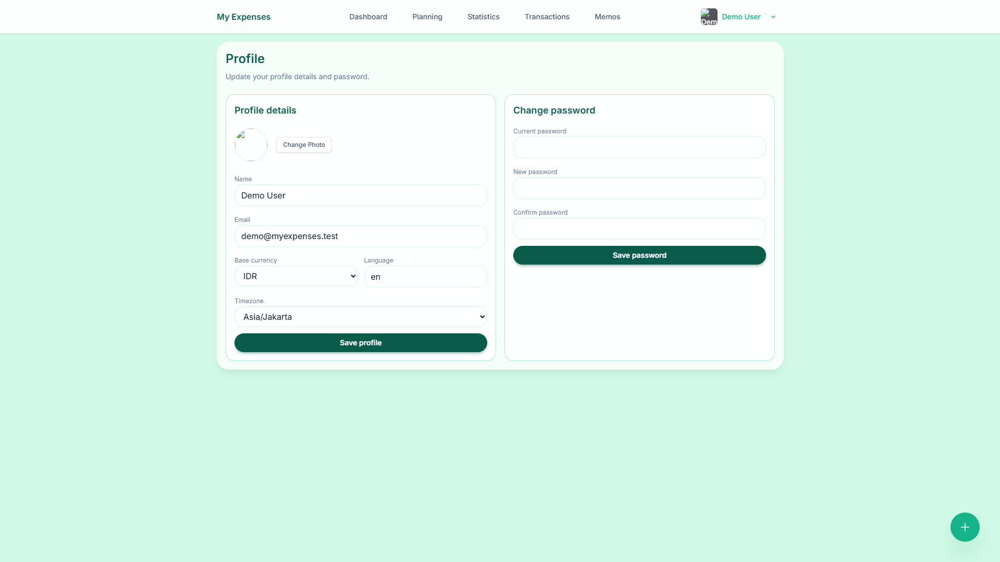
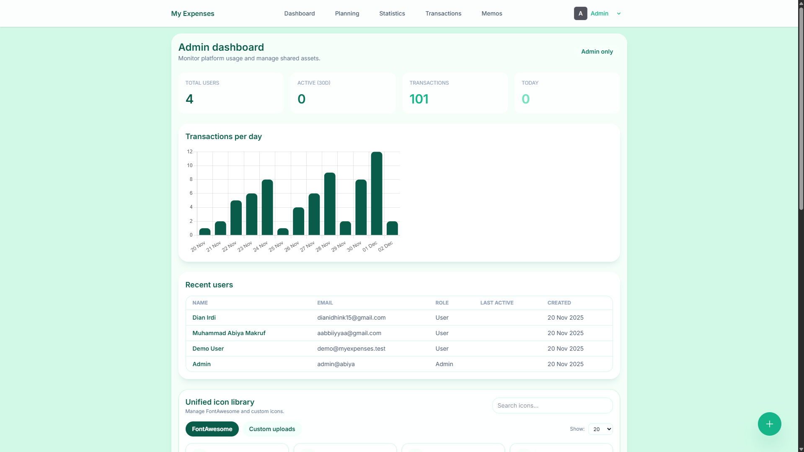
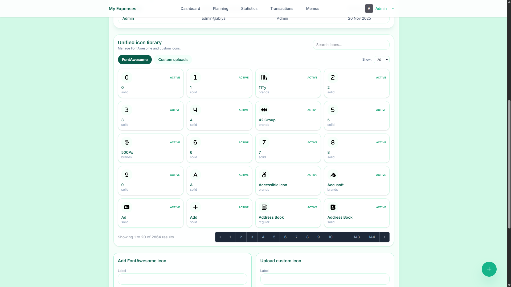

#  MyTrackerExpenses

**MyTrackerExpenses** is a comprehensive, mobile-first personal finance application built with **Laravel 12** and **Livewire 3**. It empowers users to take control of their financial life with features for tracking expenses, budgeting, setting goals, and managing recurring payments. 🚀💸

---

## ✨ Key Features

### 👤 User Features
-   **📊 Dashboard**: Get a quick overview of your financial health.
-   **📝 Transaction Tracking**: Record Income, Expenses, and Transfers easily.
-   **📅 Planning**:
    -   **Budgets**: Set monthly limits for categories.
    -   **Goals**: Track progress towards financial targets.
    -   **Recurring Transactions**: Automate regular payments.
-   **📈 Statistics**: Visualize your spending habits with rich charts.
-   **🗒️ Memos**: Keep track of notes, lists, and files (with Google Cloud Storage integration).
-   **⚙️ Settings**: Customize currency, language, and timezone.
-   **🖼️ Profile**: Manage your account and profile picture.

### 🛡️ Admin Features
-   **🔧 Admin Console**: Manage shared assets like icon libraries and system settings.
-   **👥 User Management**: Oversee user accounts.

---

## 📸 Screenshots

### 📱 User Interface
| Dashboard | Transactions | Statistics |
|:---:|:---:|:---:|
|  |  |  |

| Planning | Memos | Profile |
|:---:|:---:|:---:|
|  |  |  |

### 🔐 Admin Interface
| Admin Dashboard | Asset Management |
|:---:|:---:|
|  |  |

---

## 🛠️ Tech Stack

-   **Backend**: Laravel 12, PHP 8.2, Livewire 3
-   **Database**: PostgreSQL (Supabase)
-   **Frontend**: Blade, Tailwind CSS, Alpine.js
-   **Infrastructure**: Docker, Google Cloud Run

---

## 🚀 Getting Started (Local Development)

Follow these steps to run the project locally:

1.  **Clone the Repository**
    ```bash
    git clone <repo-url> tracker-expenses
    cd tracker-expenses
    ```

2.  **Install Dependencies**
    ```bash
    composer install
    npm install
    ```

3.  **Environment Setup**
    Copy the example environment file and generate the key:
    ```bash
    cp .env.example .env
    php artisan key:generate
    ```
    > 📝 **Note**: Update `.env` with your database credentials (PostgreSQL/Supabase) and other configurations.

4.  **Database Setup**
    Run migrations and seed the database:
    ```bash
    php artisan migrate --seed
    ```

5.  **Run the Application**
    Start the development servers:
    ```bash
    php artisan serve        # Backend (http://127.0.0.1:8000)
    npm run dev              # Frontend (Vite)
    ```

---

## ☁️ Deploy to Google Cloud Run

This project is optimized for deployment on **Google Cloud Run**.

### 📋 Prerequisites
To deploy this application, you will need:
-   **Google Cloud Platform (GCP) Project**
-   **Service Account (SA)** with appropriate permissions (Cloud Run Admin, Storage Admin, etc.).
-   **Supabase Account** (or any PostgreSQL database accessible from Cloud Run).
-   **Google Cloud Storage (GCS)** bucket for file uploads.

### 🔐 Sensitive Configuration Files
⚠️ **IMPORTANT**: The necessary Service Account (SA) JSON key and the production environment variables (`cloudrun.env`) are **NOT** included in this repository for security reasons.

-   These files are provided in a **password-protected ZIP file**.
-   Please **contact the repository owner** to obtain the password and access these files.
-   Once extracted, place the SA key and `cloudrun.env` in the project root before deploying.

### 🚀 Deployment Script
We have provided a convenience script `deploy.sh` to streamline the deployment process.

1.  Ensure you have the **Google Cloud SDK** installed and authenticated.
2.  Make the script executable:
    ```bash
    chmod +x deploy.sh
    ```
3.  Run the deployment script:
    ```bash
    ./deploy.sh
    ```
    *This script will build the Docker image, push it to Google Container Registry (GCR), and deploy the service to Cloud Run using the configuration from `cloudrun.env`.*

---

Made with ❤️ by AbiyaMakruf